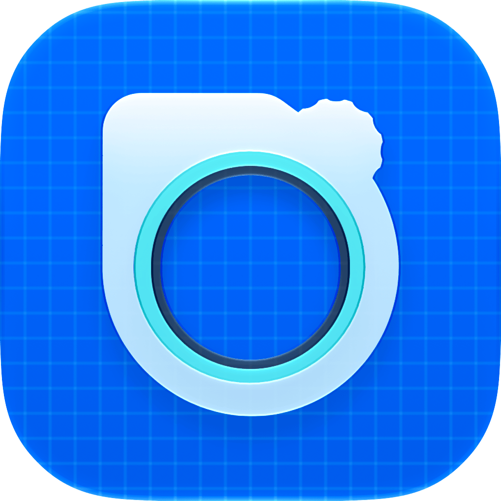
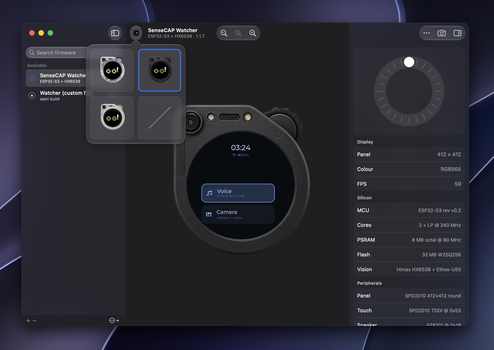
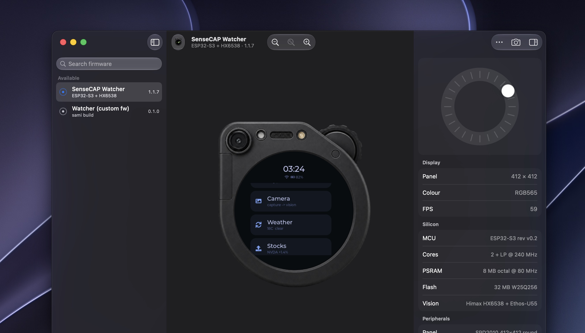

<p align="center">
  
  <h1 align="center">SeedSim</h1>
  <p align="center">A native macOS simulator for SenseCAP Watcher firmware</p>
</p>

<p align="center">
  <a href="https://github.com/Aayush9029/SeedSim/releases/latest"></a>
  
  
</p>

<p align="center">
  
</p>

## What it is

The SenseCAP Watcher runs LVGL on an ESP32-S3 behind a 412x412 round panel. Iterating on that UI normally means building with ESP-IDF and flashing over USB, which is slow enough to kill the fun.

SeedSim compiles the same LVGL 8.4 the firmware uses, renders it into a framebuffer, and composites it into a photo of the real device. Your UI code runs unchanged. Edit, rebuild, see it in about two seconds.

<p align="center">
  
</p>

## Install

Grab the latest `.app` from [releases](https://github.com/Aayush9029/SeedSim/releases/latest), or build it yourself:

```bash
git clone https://github.com/Aayush9029/SeedSim
cd SeedSim
./Scripts/package_app.sh release
open SeedSim.app
```

Needs macOS 26 and Apple Silicon. No Xcode project, just SwiftPM.

## Using it

The panel is live. Click it to touch, and drive the rotary knob however you like:

| Input | Does |
| --- | --- |
| `←` `→` | Rotate the knob one detent |
| `Return` | Press |
| `Space` | Long press |
| Scroll | Rotate |
| Click the panel | Touch |
| Drag the dial | Rotate, with trackpad haptics per detent |

Three device frames ship with it (clear shell, steel white, matte black) plus a frameless mode. Zoom, screenshot, and copy-to-clipboard live in the toolbar.

The inspector reads out the real board: ESP32-S3 rev v0.2, 8 MB octal PSRAM, 32 MB W25Q256 flash, SPD2010 panel, ES8311 and ES7243E audio, and the Himax HX6538 behind the camera.

## Writing UI for it

UI lives in `Sources/CLVGL/ui_home.c` as ordinary LVGL 8.4 C. The same file compiles into the firmware, so anything you build here ports across without changes.

```bash
swift build && ./Scripts/package_app.sh release && open SeedSim.app
```

The knob arrives as an `LV_INDEV_TYPE_ENCODER` device with a default group already attached, and touch as `LV_INDEV_TYPE_POINTER`. Worth knowing: the firmware's BSP does not attach a group to its encoder, so a screen that works here needs `lv_indev_set_group` on device.

## How the device frames work

Frame artwork comes out of a design tool at different scales and canvas sizes, so switching frames used to make the device jump. `Scripts/normalize_frames.py` fixes that with OpenCV. It finds the panel disc in each frame, scales every frame so the radii match, and shifts them so the centres align. Dark bodies defeat thresholding, so those borrow geometry from a light frame with the same silhouette.

Each frame then gets two assets: the full image for the picker, and a version with the panel punched out for the stage. That lets the app layer black, then the live panel, then the frame on top, so the bezel sits over the panel edge the way it does in real life.

To add a frame, point the script at your source artwork and it regenerates every asset plus the manifest:

```bash
uv run --with opencv-python-headless --with numpy \
  python Scripts/normalize_frames.py Sources/SeedSim/Resources path/to/frames/*.png
```

## Layout

```
Sources/
  CLVGL/              LVGL 8.4, the framebuffer engine, and your UI
  SeedSim/
    App/              Entry point, window, toolbar
    Simulator/        Engine wrapper and the device stage
    Frames/           Frame model and pickers
    Devices/          Firmware list and board facts
    Inspector/        Knob dial and inspector panel
Scripts/              Packaging and frame calibration
```

## License

MIT
